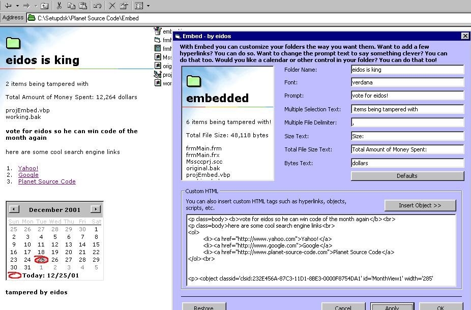



## Embed

### Description

Look at the screenshot. With embed you can modify the windows folder look to suit your style. Do you want a few links in the window, do you want a calendar, how about a custom title for your folders. Maybe a custom font? It's up to you with Embed. You have to see the screenshot. Don't forget to vote! Make sure you have folders set to view as a web page!
 
### More Info
 
NOPE.

Happiness Joy.

             |
---                |---
**Submitted On**   |2001-12-25 19:59:20
**By**             |[eidos](https://github.com/Planet-Source-Code/PSCIndex/blob/master/ByAuthor/eidos.md)
**Level**          |Advanced
**User Rating**    |4.6 (46 globes from 10 users)
**Compatibility**  |VB 5\.0, VB 6\.0
**Category**       |[Miscellaneous](https://github.com/Planet-Source-Code/PSCIndex/blob/master/ByCategory/miscellaneous__1-1.md)
**World**          |[Visual Basic](https://github.com/Planet-Source-Code/PSCIndex/blob/master/ByWorld/visual-basic.md)
**Archive File**   |[Embed4401212252001\.zip](https://github.com/Planet-Source-Code/eidos-embed__1-30115/archive/master.zip)

### API Declarations

only 2 i think?

